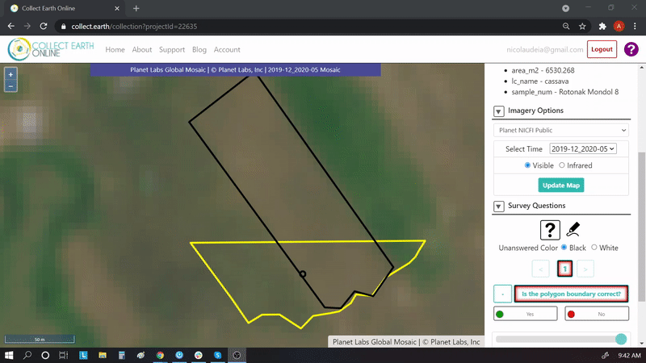

--------
Module 2
--------

1. Background
--------------

Backgroud goes here. Can include subsections (e.g. 1.1, 1.2, etc)

1.1 Background subsection
=========================

Background subsection....

2. Learning objectives
-----------------------

In this tutorial you will learn how to: (or something like this):

* Objective 1
* Objective 2

2.1 Pre-requisites
===================

* Basic to intermediate understanding of remote sensing concepts

  * You may refer to `NASA ARSET's Fundamentals of Remote Sensing <https://appliedsciences.nasa.gov/join-mission/training/english/fundamentals-remote-sensing>`_ training. This includes basics of satellite remote sensing, including satellite orbits, types, resolutions, sensors, and processing levels. It is on demand and anyone can take it (available only in English).
  
* A Google Earth Engine account

  * Anyone can sign up for Google Earth Engine. GEE is free for non-commercial use. To sign up, please fill out `this form <https://earthengine.google.com/signup/>`_. Once you have been accepted, you will receive an email with additional information

* Google Earth Engine works best with `Google Chrome browser <https://www.google.com/chrome/>`_.

3. Tutorial: Name of tutorial here
----------------------------------

Text here if needed

3.1 Subsection 1
================

(example ordered list)
Follow these instructions:

1. Do this.

2. Do that.

  a. sublist item.

    i. subsub list item
    ii. subsub list item

        Indented note

  b. sublist item
  c. sublist item
  d. sublist item

.. warning::
   Warning text

3. Do also this

  a. text
  b. text
  c. text
  d. text
  e. text
  
  (example figure. adjust width if desired by adding :width: (width size; number) below :align:)
  
.. figure:: images/example.png
   :alt: Legend goes here.
   :align: center

More text

(also supports gifs)

(and videos)

.. raw:: html

    

    <iframe width="100%" height="350" <iframe width="560" height="315" src="https://www.youtube-nocookie.com/embed/uHKfrz65KSU" title="YouTube video player" frameborder="0" allow="accelerometer; autoplay; clipboard-write; encrypted-media; gyroscope; picture-in-picture" allowfullscreen></iframe>
    

3.2 Subsection 2
================

Text here

.. note::
   Note text

4. Frequently Asked Questions (FAQs)
------------------------------------

**Question here (in bold)**

Answer

5. References
-------------

Kennedy, R.E., Ohmann, J., Gregory, M., Roberts, H., Yang, Z., Bell, D.M., Kane, V., Hughes, M.J., Cohen, W.B., Powell, S. and Neeti, N., 2018. An empirical, integrated forest biomass monitoring system. *Environmental Research Letters*, *13* (2), p.025004. https://doi.org/10.1088/1748-9326/aa9d9e

=======================

.. figure:: images/cc.png

This work is licensed under a `Creative Commons Attribution BY 4.0 <https://creativecommons.org/licenses/by/4.0/>`_

Copyright 2021, Spatial Informatics Group

(Last name), (First letter of first name). (Year). Title of training. © Spatial Informatics Group. License: `Creative Commons Attribution license (CC BY 4.0) <https://creativecommons.org/licenses/by/4.0/>`_ 

